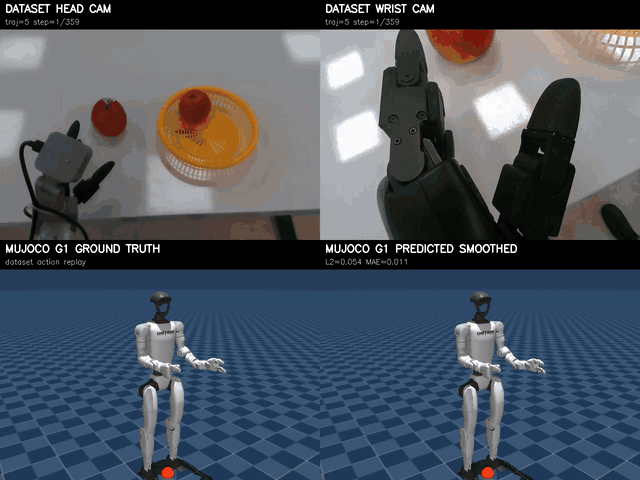

# Isaac-GR00T-Duong

Fork of NVIDIA Isaac GR00T N1.7 for a custom Unitree G1 Dex3 pick-and-put workflow.

This repo focuses on one local embodiment:

- Dataset: `demo_data/pick_and_put_v4_converted`
- Task: pick apple and put in the box
- Cameras: `head_cam`, `left_wrist_cam`
- State/action: `left_arm`, `left_hand`
- Action dimension: 14 DOF
- Checkpoints: `checkpoint-50000`, `checkpoint-100000`, `checkpoint-150000`, `checkpoint-200000`

The original GR00T project is from NVIDIA. This fork keeps the upstream model and training stack, then adds dataset naming cleanup, open-loop action smoothing, and MuJoCo four-panel replay for visual evaluation.

## What This Repo Adds

- Canonical camera naming: `head_cam` and `left_wrist_cam`.
- G1 pick-and-put modality config: `examples/G1_PickAndPut/g1_pick_and_put_config.py`.
- Open-loop evaluation with optional One Euro action smoothing and delta clipping.
- MuJoCo four-panel replay:
  - dataset head camera
  - dataset wrist camera
  - MuJoCo ground-truth replay
  - MuJoCo predicted replay
- Optional streaming smoothing in MuJoCo predicted replay.
- Runbook and change log:
  - `serving-server-client.md`
  - `action.md`

## Results Gallery

The curated result files are stored in `final/`. Large raw experiment folders and checkpoints are intentionally not tracked.





### Open-Loop Plots

| Checkpoint | Plot |
|---|---|
| checkpoint-50000, horizon 8 | [checkpoint-50000_8.jpeg](final/checkpoint-50000_8.jpeg) |
| checkpoint-50000, horizon 16 | [checkpoint-50000_16.jpeg](final/checkpoint-50000_16.jpeg) |
| checkpoint-100000, horizon 8 | [checkpoint-100000_8.jpeg](final/checkpoint-100000_8.jpeg) |
| checkpoint-200000, horizon 8 | [checkpoint-200000_8.jpeg](final/checkpoint-200000_8.jpeg) |

### MuJoCo Four-Panel Videos

GitHub README rendering works reliably with relative image/file links. The videos below are committed as small MP4 files and linked directly.

| Checkpoint | Trajectory | Video |
|---|---:|---|
| checkpoint-50000 | 5 | [traj_5_four_panel.mp4](final/checkpoint-50000_8/traj_5_four_panel.mp4) |
| checkpoint-50000 | 25 | [traj_25_four_panel.mp4](final/checkpoint-50000_8/traj_25_four_panel.mp4) |
| checkpoint-50000 | 125 | [traj_125_four_panel.mp4](final/checkpoint-50000_8/traj_125_four_panel.mp4) |
| checkpoint-100000 | 5 | [traj_5_four_panel.mp4](final/checkpoint-100000_8/traj_5_four_panel.mp4) |
| checkpoint-100000 | 25 | [traj_25_four_panel.mp4](final/checkpoint-100000_8/traj_25_four_panel.mp4) |
| checkpoint-100000 | 125 | [traj_125_four_panel.mp4](final/checkpoint-100000_8/traj_125_four_panel.mp4) |
| checkpoint-200000 | 5 | [traj_5_four_panel.mp4](final/checkpoint-200000_8/traj_5_four_panel.mp4) |
| checkpoint-200000 | 25 | [traj_25_four_panel.mp4](final/checkpoint-200000_8/traj_25_four_panel.mp4) |
| checkpoint-200000 | 125 | [traj_125_four_panel.mp4](final/checkpoint-200000_8/traj_125_four_panel.mp4) |

## Setup

Follow the upstream NVIDIA Isaac GR00T N1.7 setup first.

```bash
uv sync --python 3.10
```

On this local WSL workflow, the commands in `serving-server-client.md` use `.venv/bin/python` directly to avoid repeated `uv run` wheel checks.

```bash
export UV_LINK_MODE=copy
export NO_ALBUMENTATIONS_UPDATE=1
```

Checkpoints are expected locally under:

```text
checkpoints/
├── checkpoint-50000/
├── checkpoint-100000/
├── checkpoint-150000/
└── checkpoint-200000/
```

The `checkpoints/` directory is ignored by git.

The custom dataset is expected locally under:

```text
demo_data/pick_and_put_v4_converted/
├── meta/
├── data/
└── videos/
```

This repo tracks the folder skeleton and small README files for `checkpoints/`, `demo_data/pick_and_put_v4_converted/`, and `my-outputs/`, but it does not track the real checkpoint weights, dataset parquet/video files, or generated evaluation outputs. After cloning, copy your dataset and checkpoints into those existing folders and the commands below should run without recreating the layout.

## Open-Loop Evaluation

```bash
cd /mnt/e/Vin/Groot/Isaac-GR00T-Duong

export UV_LINK_MODE=copy
export NO_ALBUMENTATIONS_UPDATE=1

CHECKPOINT_NAME=checkpoint-200000
ACTION_HORIZON=8

.venv/bin/python gr00t/eval/open_loop_eval.py \
  --dataset-path /mnt/e/Vin/Groot/Isaac-GR00T-Duong/demo_data/pick_and_put_v4_converted \
  --model-path /mnt/e/Vin/Groot/Isaac-GR00T-Duong/checkpoints/${CHECKPOINT_NAME} \
  --embodiment-tag NEW_EMBODIMENT \
  --traj-ids 100 \
  --action-horizon ${ACTION_HORIZON} \
  --steps 180 \
  --smooth-actions \
  --one-euro-freq 30 \
  --one-euro-min-cutoff 1 \
  --one-euro-beta 0.7 \
  --one-euro-d-cutoff 1.0 \
  --action-delta-clip 1.2 \
  --save-plot-path /mnt/e/Vin/Groot/Isaac-GR00T-Duong/my-outputs/open_loop_eval/${CHECKPOINT_NAME}_${ACTION_HORIZON}.jpeg
```

## MuJoCo Four-Panel Replay

Raw output uses:

```text
my-outputs/mujoco_four_panel_eval/
```

Smoothed output uses:

```text
my-outputs/mujoco_four_panel_eval_smoth/
```

The folder name `smoth` is kept intentionally to match the local experiment naming.

```bash
cd /mnt/e/Vin/Groot/Isaac-GR00T-Duong

export UV_LINK_MODE=copy
export NO_ALBUMENTATIONS_UPDATE=1

CHECKPOINT_NAME=checkpoint-200000
ACTION_HORIZON=8

.venv/bin/python gr00t/eval/mujoco_four_panel_replay.py \
  --dataset-path /mnt/e/Vin/Groot/Isaac-GR00T-Duong/demo_data/pick_and_put_v4_converted \
  --model-path /mnt/e/Vin/Groot/Isaac-GR00T-Duong/checkpoints/${CHECKPOINT_NAME} \
  --embodiment-tag NEW_EMBODIMENT \
  --mujoco-model-path /mnt/e/Vin/Groot/Isaac-GR00T-Duong/assets/lerobot_unitree_g1_mujoco/assets/scene_43dof.xml \
  --output-dir /mnt/e/Vin/Groot/Isaac-GR00T-Duong/my-outputs/mujoco_four_panel_eval_smoth/${CHECKPOINT_NAME}_${ACTION_HORIZON} \
  --traj-ids 5 25 125 \
  --max-steps 360 \
  --action-horizon ${ACTION_HORIZON} \
  --smooth-actions \
  --one-euro-freq 30 \
  --one-euro-min-cutoff 1 \
  --one-euro-beta 0.7 \
  --one-euro-d-cutoff 1.0 \
  --action-delta-clip 1.2 \
  --camera free \
  --width 640 \
  --height 480 \
  --fps 30
```

## Notes On Smoothing

One Euro filtering is used as a lightweight post-processing step for predicted actions.

- In open-loop, smoothing is applied offline to the predicted action trajectory for plotting.
- In MuJoCo, smoothing is applied step-by-step before the predicted action is rendered.
- `--action-delta-clip` clips sudden per-step jumps before the One Euro filter. This helps with outlier spikes, but it cannot fix model-level prediction errors.

## Important Files

| File | Purpose |
|---|---|
| `action.md` | Detailed local change log versus NVIDIA upstream |
| `serving-server-client.md` | Local run commands for open-loop, server-client, and MuJoCo |
| `gr00t/eval/open_loop_eval.py` | Open-loop evaluation with smoothing plot |
| `gr00t/eval/mujoco_four_panel_replay.py` | Custom G1 four-panel MuJoCo replay |
| `examples/G1_PickAndPut/g1_pick_and_put_config.py` | Modality config for this dataset/checkpoint setup |
| `assets/ASSET_SOURCES.md` | Asset source notes for Unitree/LeRobot MuJoCo models |

## Upstream

- NVIDIA Isaac GR00T: https://github.com/NVIDIA/Isaac-GR00T
- GR00T model collection: https://huggingface.co/collections/nvidia/gr00t-n17
- MuJoCo Python docs: https://mujoco.readthedocs.io/en/latest/python.html
- GitHub README relative links: https://docs.github.com/articles/relative-links-in-readmes

## License

Code follows the upstream Apache 2.0 license from NVIDIA Isaac GR00T. Model weights are governed by NVIDIA's model license.
