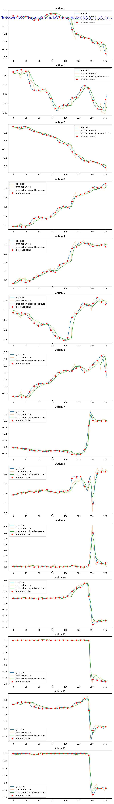

# Isaac-GR00T-Duong - Custom Changes

Ngày tạo: 2026-06-02
Lần cập nhật cuối: 2026-06-08

## Hướng dẫn cho Agent (BẮT BUỘC)

> **QUAN TRỌNG:** File này ghi lại **tất cả các thay đổi** so với repo gốc NVIDIA trên GitHub (`nvidia/isaac-gr00t`). Khi sửa bất kỳ file nào trong thư mục `gr00t/`, phải so sánh với phiên bản gốc từ NVIDIA chứ **KHÔNG PHẢI** so với phiên bản đã sửa trong workspace này.

### Quy tắc bắt buộc

1. **Mọi thay đổi đều phải ghi vào file này**, bao gồm:
   - Thêm file/script mới
   - Sửa file của repo gốc
   - Thay đổi dataset, checkpoint, hoặc cấu hình
   - Chạy thành công lệnh mới
   - Lỗi và cách xử lý

2. **So sánh với repo gốc NVIDIA:**
   - Dùng `git diff` với upstream/main branch
   - Hoặc tải file gốc từ GitHub để đối chiếu
   - **KHÔNG** so sánh với phiên bản đã sửa trong workspace

3. **Nội dung cần ghi cho mỗi thay đổi:**
   - Tên file và trạng thái (mới / đã sửa)
   - Code cũ (từ repo NVIDIA) vs code mới
   - Lệnh đã chạy
   - Output kết quả
   - Thông tin dataset/checkpoint liên quan

4. **Ngôn ngữ:** Tiếng Việt có dấu cho giải thích, tiếng Anh cho thuật ngữ kỹ thuật

## Mục lục

- [MuJoCo Evaluation](#mujoco-evaluation)
- [GitHub README và Output Cleanup 2026-06-09](#github-readme-và-output-cleanup-2026-06-09)
- [MuJoCo One Euro Action Smoothing 2026-06-08](#mujoco-one-euro-action-smoothing-2026-06-08)
- [Open-Loop One Euro Action Smoothing 2026-06-08](#open-loop-one-euro-action-smoothing-2026-06-08)
- [MuJoCo Action Slice Fix 2026-06-05](#mujoco-action-slice-fix-2026-06-05)
- [MuJoCo Four Panel Rename 2026-06-05](#mujoco-four-panel-rename-2026-06-05)
- [Dataset và Checkpoint](#dataset-và-checkpoint)
- [Camera Naming Cleanup 2026-06-04](#camera-naming-cleanup-2026-06-04)
- [Quy tắc ghi](#quy-tắc-ghi)

---

# GitHub README và Output Cleanup 2026-06-09

## Vấn đề

Cần đưa repo lên GitHub nhưng không push toàn bộ checkpoint/cache/output thô. README upstream của NVIDIA quá dài và chưa phản ánh workflow local của repo này. Cần README mới có ảnh/video kết quả để người xem thấy được các phần đã làm.

Nguồn đối chiếu:

```text
GitHub README relative links:
https://docs.github.com/articles/relative-links-in-readmes
```

## File đã sửa

### `README.md`

- Trạng thái cũ từ NVIDIA: README giới thiệu chung Isaac GR00T N1.7 upstream.
- Trạng thái mới: README riêng cho `Isaac-GR00T-Duong`, mô tả dataset/checkpoint G1 Dex3, open-loop smoothing, MuJoCo four-panel replay, lệnh chạy và gallery output.
- Lý do: repo GitHub cần cho người xem hiểu đúng đây là fork local cho Unitree G1 Dex3 pick-and-put.
- Cập nhật 2026-06-09: đổi open-loop plot từ ảnh embed sang link thường để README không bị kéo quá dài trên trang chính.

Code cũ từ NVIDIA:

```markdown
# NVIDIA Isaac GR00T
...
## Installation
...
## Evaluation
...
```

Code mới chính:

```markdown
# Isaac-GR00T-Duong

Fork of NVIDIA Isaac GR00T N1.7 for a custom Unitree G1 Dex3 pick-and-put workflow.
...
## Results Gallery
...

...
[traj_5_four_panel.mp4](final/checkpoint-50000_8/traj_5_four_panel.mp4)
```

Code mới sau cập nhật link ảnh:

```markdown
| checkpoint-50000, horizon 8 | [checkpoint-50000_8.jpeg](final/checkpoint-50000_8.jpeg) |
```

### `.gitignore`

- Trạng thái cũ: `my-outputs/` chưa được ignore.
- Trạng thái mới: thêm `my-outputs/`.
- Lý do: tránh push checkpoint metadata, CSV, MP4/JPEG output thô và cache chạy thử lên GitHub.

Code cũ:

```gitignore
outputs/
checkpoints/
```

Code mới:

```gitignore
outputs/
my-outputs/
checkpoints/
```

### `final/`

- Trạng thái cũ từ NVIDIA: không tồn tại.
- Trạng thái mới: folder curated chứa ảnh open-loop và MP4 nhỏ để README link trực tiếp.
- Lý do: chỉ public output đại diện, không public toàn bộ `my-outputs/`.

File public:

```text
final/checkpoint-50000_8.jpeg
final/checkpoint-50000_16.jpeg
final/checkpoint-100000_8.jpeg
final/checkpoint-200000_8.jpeg
final/checkpoint-50000_8/traj_5_four_panel.mp4
final/checkpoint-50000_8/traj_25_four_panel.mp4
final/checkpoint-50000_8/traj_125_four_panel.mp4
final/checkpoint-100000_8/traj_5_four_panel.mp4
final/checkpoint-100000_8/traj_25_four_panel.mp4
final/checkpoint-100000_8/traj_125_four_panel.mp4
```

### `my-outputs/`

- Trạng thái cũ: một số file output/checkpoint metadata đang được Git track.
- Trạng thái mới: bỏ nội dung thật khỏi Git index bằng `git rm -r --cached my-outputs`, giữ file local trên máy; sau đó track lại skeleton folder bằng `README.md` và `.gitkeep`.
- Lý do: GitHub chỉ nên chứa code, docs, output curated trong `final/`, và khung folder để người sau biết đặt output vào đâu.

Lệnh đã chạy:

```bash
git rm -r --cached my-outputs
```

## Cập nhật skeleton folder 2026-06-09

Sau phản hồi của người dùng, cần giữ khung thư mục để người clone repo chỉ cần copy dataset/checkpoint vào đúng chỗ là chạy được.

### `.gitignore`

- Trạng thái cũ: ignore toàn bộ `my-outputs/` và `checkpoints/`.
- Trạng thái mới: ignore nội dung thật nhưng unignore README/`.gitkeep` cho skeleton.
- Lý do: giữ cấu trúc folder trên GitHub mà không upload checkpoint, dataset hoặc output thô.

Code mới chính:

```gitignore
my-outputs/*
!my-outputs/README.md
!my-outputs/open_loop_eval/
my-outputs/open_loop_eval/*
!my-outputs/open_loop_eval/.gitkeep

checkpoints/*
!checkpoints/README.md
!checkpoints/checkpoint-50000/
checkpoints/checkpoint-50000/*
!checkpoints/checkpoint-50000/.gitkeep
```

### `demo_data/.gitignore`

- Trạng thái cũ: `*`, ignore toàn bộ data mới trong `demo_data`.
- Trạng thái mới: vẫn ignore data thật, nhưng cho phép track skeleton `pick_and_put_v4_converted`.
- Lý do: dataset custom không được upload, nhưng folder đích cần hiện sẵn.

Code mới chính:

```gitignore
*
!pick_and_put_v4_converted/
pick_and_put_v4_converted/*
!pick_and_put_v4_converted/README.md
!pick_and_put_v4_converted/data/
pick_and_put_v4_converted/data/*
!pick_and_put_v4_converted/data/.gitkeep
```

### Folder skeleton mới

```text
checkpoints/README.md
checkpoints/checkpoint-50000/.gitkeep
checkpoints/checkpoint-100000/.gitkeep
checkpoints/checkpoint-150000/.gitkeep
checkpoints/checkpoint-200000/.gitkeep

demo_data/pick_and_put_v4_converted/README.md
demo_data/pick_and_put_v4_converted/data/.gitkeep
demo_data/pick_and_put_v4_converted/meta/.gitkeep
demo_data/pick_and_put_v4_converted/videos/.gitkeep

my-outputs/README.md
my-outputs/experiment_cfg/.gitkeep
my-outputs/processor/.gitkeep
my-outputs/open_loop_eval/.gitkeep
my-outputs/mujoco_four_panel_eval/.gitkeep
my-outputs/mujoco_four_panel_eval_smoth/.gitkeep
```

### `README.md`

- Trạng thái mới: bổ sung hướng dẫn rằng repo chỉ track skeleton folder; người dùng cần copy dataset/checkpoint thật vào các folder có sẵn.

---

# MuJoCo One Euro Action Smoothing 2026-06-08

## Vấn đề

Sau khi thử One Euro trong open-loop plot, cần áp dụng cùng ý tưởng vào MuJoCo replay để xem video predicted action đã mượt hơn chưa. Output mới phải tách khỏi output cũ bằng folder riêng:

```text
my-outputs/mujoco_four_panel_eval_smoth/
```

Ghi chú: giữ nguyên spelling `smoth` theo yêu cầu folder của người dùng để dễ nhận biết output mới.

Nguồn đối chiếu:

```text
One Euro filter: Casiez, Roussel, Vogel (2012), 1€ Filter.
MuJoCo Python renderer: mujoco.Renderer.update_scene/render trong tài liệu MuJoCo Python.
```

## File đã sửa

### `gr00t/eval/mujoco_four_panel_replay.py`

- Trạng thái cũ từ NVIDIA: file không tồn tại trong repo NVIDIA.
- Trạng thái cũ local: MuJoCo replay dùng predicted action raw trực tiếp để set pose cho panel predicted.
- Trạng thái mới: thêm optional streaming One Euro smoothing cho predicted action trước khi đưa vào `_set_pose()`.
- Lý do: mô phỏng đúng hơn tình huống robot chạy thật, nơi action được xử lý step-by-step chứ không lọc offline cả trajectory.

Code cũ local:

```python
gt_action = _extract_vector(traj, step, list(action_keys), "action")
pred_action = pred_cache.pop(0)
_set_pose(model, gt_data, gt_action, qpos_map)
_set_pose(model, pred_data, pred_action, qpos_map)
```

Code mới:

```python
gt_action = _extract_vector(traj, step, list(action_keys), "action")
raw_pred_action = pred_cache.pop(0)
pred_action = action_smoother(raw_pred_action)
_set_pose(model, gt_data, gt_action, qpos_map)
_set_pose(model, pred_data, pred_action, qpos_map)
```

Thêm CLI flags:

```python
smooth_actions: bool = False
one_euro_freq: float = 30.0
one_euro_min_cutoff: float = 1.0
one_euro_beta: float = 0.05
one_euro_d_cutoff: float = 1.0
action_delta_clip: float = 0.0
```

Thêm streaming smoother:

```python
class StreamingActionSmoother:
    """Apply optional delta clipping and One Euro filtering step by step."""

    def __call__(self, action: np.ndarray) -> np.ndarray:
        action = np.asarray(action, dtype=np.float32)
        if not self.enabled:
            return action

        filter_input = action
        if self.action_delta_clip > 0.0:
            if self.prev_clipped_action is None:
                filter_input = action.copy()
            else:
                filter_input = np.clip(
                    action,
                    self.prev_clipped_action - self.action_delta_clip,
                    self.prev_clipped_action + self.action_delta_clip,
                )
            self.prev_clipped_action = filter_input.copy()

        return self.filter(filter_input)
```

CSV output được mở rộng để giữ cả raw và action sau smoothing:

```python
fieldnames=[
    "step",
    "inference_ms",
    "raw_action_l2_error",
    "raw_action_mae_error",
    "action_l2_error",
    "action_mae_error",
    "action_is_smoothed",
]
```

Summary output thêm smoothing config:

```json
"smoothing": {
  "enabled": true,
  "one_euro_freq": 30,
  "one_euro_min_cutoff": 1,
  "one_euro_beta": 0.7,
  "one_euro_d_cutoff": 1.0,
  "action_delta_clip": 1.2
}
```

### `serving-server-client.md`

- Trạng thái cũ từ NVIDIA: file không tồn tại trong repo NVIDIA.
- Trạng thái cũ local: lệnh MuJoCo lưu vào `my-outputs/mujoco_four_panel_eval/...` và chưa bật smoothing.
- Trạng thái mới: lệnh MuJoCo bật smoothing và lưu vào `my-outputs/mujoco_four_panel_eval_smoth/...`.
- Lý do: phân biệt rõ video cũ raw và video mới smoothing.

Code cũ local:

```bash
--output-dir /mnt/e/Vin/Groot/Isaac-GR00T-Duong/my-outputs/mujoco_four_panel_eval/${CHECKPOINT_NAME}_${ACTION_HORIZON}
```

Code mới:

```bash
--output-dir /mnt/e/Vin/Groot/Isaac-GR00T-Duong/my-outputs/mujoco_four_panel_eval_smoth/${CHECKPOINT_NAME}_${ACTION_HORIZON} \
--smooth-actions \
--one-euro-freq 30 \
--one-euro-min-cutoff 1 \
--one-euro-beta 0.7 \
--one-euro-d-cutoff 1.0 \
--action-delta-clip 1.2
```

## Kết quả kiểm tra

Đã chạy compile check:

```bash
python -m py_compile gr00t/eval/mujoco_four_panel_replay.py
```

Kết quả:

```text
OK
```

---

# Open-Loop One Euro Action Smoothing 2026-06-08

## Vấn đề

Khi xem open-loop plot và video replay, predicted action có hiện tượng rung/giật mạnh ở tay robot, đặc biệt tại các đoạn chuyển động và ranh giới giữa các action chunks. Cần thử smoothing trong open-loop trước để quan sát ảnh plot, chưa sửa MuJoCo replay.

Nguồn thuật toán:

```text
Casiez, G., Roussel, N., Vogel, D. (2012). 1€ Filter: A Simple Speed-based Low-pass Filter for Noisy Input in Interactive Systems.
https://direction.bordeaux.inria.fr/~roussel/publications/2012-CHI-one-euro-filter.pdf
```

Ghi chú: One Euro filter là low-pass filter có cutoff thích nghi theo tốc độ. Khi tín hiệu thay đổi chậm, cutoff thấp để giảm jitter; khi tín hiệu thay đổi nhanh, cutoff tăng để giảm lag.

## File đã sửa

### `gr00t/eval/open_loop_eval.py`

- Trạng thái cũ từ NVIDIA: open-loop plot chỉ vẽ `state joints`, `gt action`, `pred action`.
- Trạng thái mới: thêm option bật One Euro filter cho predicted action trong open-loop plot.
- Lý do: giúp so sánh trực tiếp `pred action raw` và `pred action one-euro` trên ảnh trước khi áp dụng vào MuJoCo/robot.

Code cũ từ NVIDIA:

```python
ax.plot(gt_action_across_time[:, action_idx], label="gt action")
ax.plot(pred_action_across_time[:, action_idx], label="pred action")
```

Code mới:

```python
ax.plot(gt_action_across_time[:, action_idx], label="gt action")
if filtered_pred_action_across_time is None:
    ax.plot(pred_action_across_time[:, action_idx], label="pred action")
else:
    ax.plot(pred_action_across_time[:, action_idx], label="pred action raw", alpha=0.35)
    ax.plot(
        filtered_pred_action_across_time[:, action_idx],
        label="pred action one-euro",
    )
```

Thêm implementation One Euro filter vectorized cho action 14 DOF:

```python
def _smoothing_alpha(cutoff: np.ndarray | float, freq: float) -> np.ndarray | float:
    tau = 1.0 / (2.0 * np.pi * cutoff)
    te = 1.0 / freq
    return 1.0 / (1.0 + tau / te)
```

```python
class OneEuroVectorFilter:
    """One Euro filter for a vector action stream."""

    def __call__(self, x: np.ndarray) -> np.ndarray:
        x = np.asarray(x, dtype=np.float32)
        if self.prev_x is None:
            self.prev_x = x.copy()
            self.prev_x_hat = x.copy()
            self.prev_dx_hat = np.zeros_like(x)
            return x.copy()

        dx = (x - self.prev_x) * self.freq
        d_alpha = _smoothing_alpha(self.d_cutoff, self.freq)
        dx_hat = d_alpha * dx + (1.0 - d_alpha) * self.prev_dx_hat

        cutoff = self.min_cutoff + self.beta * np.abs(dx_hat)
        alpha = _smoothing_alpha(cutoff, self.freq)
        x_hat = alpha * x + (1.0 - alpha) * self.prev_x_hat
        ...
        return x_hat.astype(np.float32)
```

Thêm CLI flags:

```python
smooth_actions: bool = False
one_euro_freq: float = 30.0
one_euro_min_cutoff: float = 1.0
one_euro_beta: float = 0.05
one_euro_d_cutoff: float = 1.0
```

Ý nghĩa:

| Flag | Ý nghĩa |
|------|---------|
| `--smooth-actions` | Bật One Euro filter cho predicted action trong open-loop plot |
| `--one-euro-freq` | Tần số sample, nên khớp FPS dataset; hiện dùng 30 |
| `--one-euro-min-cutoff` | Cutoff thấp nhất; thấp hơn thì mượt hơn khi chuyển động chậm |
| `--one-euro-beta` | Hệ số tăng cutoff theo tốc độ; cao hơn thì ít lag hơn khi chuyển động nhanh |
| `--one-euro-d-cutoff` | Cutoff cho derivative filter |
| `--action-delta-clip` | Nếu > 0, clip bước nhảy predicted action trước khi đưa vào One Euro filter |

Ghi chú về plot: chấm đỏ `inference point` đánh dấu các step query model nhưng được vẽ tại giá trị `gt action`, không phải prediction/reference point của model.

## Cập nhật outlier clipping

Sau khi xem ảnh open-loop, một số action dimensions, đặc biệt Action 8/9/10 quanh step 125-150, có spike lớn. One Euro filter không được thiết kế để xử lý outlier biên độ lớn vì khi tốc độ tăng mạnh, `beta` làm cutoff tăng và filter có xu hướng cho spike đi qua. Vì vậy thêm bước optional clip per-step delta trước khi lọc.

Code cũ:

```python
if smooth_actions:
    filtered_pred_action_across_time = apply_one_euro_filter(
        pred_action_across_time,
        freq=one_euro_freq,
        min_cutoff=one_euro_min_cutoff,
        beta=one_euro_beta,
        d_cutoff=one_euro_d_cutoff,
    )
```

Code mới:

```python
if smooth_actions:
    filter_input_action_across_time = pred_action_across_time
    if action_delta_clip > 0.0:
        filter_input_action_across_time = apply_action_delta_clip(
            pred_action_across_time,
            max_delta=action_delta_clip,
        )
        filtered_pred_action_label = "pred action clipped+one-euro"

    filtered_pred_action_across_time = apply_one_euro_filter(
        filter_input_action_across_time,
        freq=one_euro_freq,
        min_cutoff=one_euro_min_cutoff,
        beta=one_euro_beta,
        d_cutoff=one_euro_d_cutoff,
    )
```

Thêm helper:

```python
def apply_action_delta_clip(action_across_time: np.ndarray, max_delta: float) -> np.ndarray:
    if max_delta <= 0.0:
        raise ValueError(f"max_delta must be positive, got {max_delta}")

    clipped_actions = []
    prev_action = None
    for action in action_across_time:
        action = np.asarray(action, dtype=np.float32)
        if prev_action is None:
            clipped_action = action.copy()
        else:
            clipped_action = np.clip(
                action,
                prev_action - max_delta,
                prev_action + max_delta,
            )
        clipped_actions.append(clipped_action)
        prev_action = clipped_action

    return np.stack(clipped_actions, axis=0).astype(np.float32)
```

Command open-loop trong `serving-server-client.md` đã đổi sang cấu hình thử tiếp:

```bash
--smooth-actions \
--one-euro-freq 30 \
--one-euro-min-cutoff 0.5 \
--one-euro-beta 0.15 \
--one-euro-d-cutoff 1.0 \
--action-delta-clip 0.2
```

Khi bật smoothing, script vẫn tính và log raw MSE/MAE, đồng thời log thêm filtered MSE/MAE:

```text
Unnormalized Action MSE/MAE
Delta-clipped Action MSE/MAE
One Euro filtered Action MSE/MAE
```

## `serving-server-client.md`

- Trạng thái cũ từ NVIDIA: file không tồn tại trong repo NVIDIA.
- Trạng thái mới: open-loop command có thêm flags One Euro filter.
- Lý do: lệnh chạy open-loop là tài liệu vận hành, không ghi lặp trong `action.md`.

Code mới trong command:

```bash
--smooth-actions \
--one-euro-freq 30 \
--one-euro-min-cutoff 0.5 \
--one-euro-beta 0.15 \
--one-euro-d-cutoff 1.0 \
--action-delta-clip 0.2
```

Ghi chú: chưa sửa `gr00t/eval/mujoco_four_panel_replay.py`; One Euro filter hiện chỉ dùng cho open-loop visualization.

## Kết quả kiểm tra

Đã chạy compile check:

```bash
python -m py_compile gr00t/eval/open_loop_eval.py
```

Kết quả:

```text
OK
```

Đã chạy smoke test open-loop rất ngắn với `--smooth-actions`, `checkpoint-50000`, `traj_id=0`, `steps=1`, `action_horizon=1`.

Kết quả:

```text
Unnormalized Action MSE: 0.00039862937410362065
Unnormalized Action MAE: 0.01372628752142191
One Euro filtered Action MSE: 0.00039862937410362065
One Euro filtered Action MAE: 0.01372628752142191
Output: my-outputs/open_loop_eval/checkpoint-50000/traj_0_one_euro_smoke.jpeg
```

Ghi chú: với `steps=1`, raw và filtered giống nhau là đúng vì filter mới nhận sample đầu tiên. Một lần thử `steps=16`, `action_horizon=8` bị timeout ở mức tool execution, nên chưa dùng làm kết quả chính thức.

---

# MuJoCo Evaluation

## Asset G1 đã tải thêm

Đã tải asset G1 từ nguồn chính thức/công khai:

### 1. Unitree USD 29DoF

```
Nguồn: https://huggingface.co/datasets/unitreerobotics/unitree_model/tree/main/G1/29dof/usd/g1_29dof_rev_1_0
Local: assets/unitree_model/G1/29dof/usd/
```

### 2. Unitree MuJoCo G1 29DoF

```
Nguồn: https://github.com/unitreerobotics/unitree_mujoco/tree/main/unitree_robots/g1
Local: assets/unitree_mujoco/unitree_robots/g1/
- g1_29dof.xml
- scene_29dof.xml
- meshes/
```

### 3. LeRobot Unitree G1 MuJoCo body29 + hand14

```
Nguồn: https://huggingface.co/lerobot/unitree-g1-mujoco/tree/main/assets
Local: assets/lerobot_unitree_g1_mujoco/assets/
- g1_29dof_with_hand.xml (nq 50, nu 43)
- scene_43dof.xml (dùng cho replay video 4 panels)
- g1_body29_hand14.urdf
- meshes/, meshes_exo_left/, meshes_exo_right/
```

Ghi chú: USD dùng cho Isaac Sim/Isaac Lab; MuJoCo workflow nên dùng XML/MJCF.

## Script video 4 panels 2x2

### File: `gr00t/eval/mujoco_four_panel_replay.py`

- Trạng thái: không tồn tại trong repo gốc
- Lý do: tạo video 4 panels 2x2 để đánh giá với 2 cameras
- Layout mới:
  ```
  ┌──────────────────┬──────────────────┐
  │  Dataset Head Cam│ Dataset Wrist Cam│  ← Row 1: Cameras từ dataset
  ├──────────────────┼──────────────────┤
  │  Ground Truth    │    Predicted     │  ← Row 2: MuJoCo simulation
  └──────────────────┴──────────────────┘
  ```

### Code chính

```python
# Require canonical head and wrist camera keys from modality config
required_video_keys = ["head_cam", "left_wrist_cam"]
missing_video_keys = [key for key in required_video_keys if key not in video_keys]
if missing_video_keys:
    raise ValueError(
        f"Missing required video keys {missing_video_keys}. "
        f"Expected canonical keys {required_video_keys}, got {video_keys}."
    )
head_cam_key = "head_cam"
wrist_cam_key = "left_wrist_cam"

# Get both camera frames from dataset
head_frame = _resize_rgb(traj[f"video.{head_cam_key}"].iloc[step], (args.width, args.height))
wrist_frame = _resize_rgb(traj[f"video.{wrist_cam_key}"].iloc[step], (args.width, args.height))

# Create 2x2 layout
top_row = np.concatenate([
    _caption(head_frame, "DATASET HEAD CAM", subtitle),
    _caption(wrist_frame, "DATASET WRIST CAM", subtitle),
], axis=1)
bottom_row = np.concatenate([
    _caption(gt_frame, "MUJOCO G1 GROUND TRUTH", "dataset action replay"),
    _caption(pred_frame, "MUJOCO G1 PREDICTED", f"L2={l2_error:.3f} MAE={mae_error:.3f}"),
], axis=1)
recorder.write_frame(np.concatenate([top_row, bottom_row], axis=0))
```

### Output

```
my-outputs/mujoco_four_panel_eval/
├── traj_0_four_panel.mp4    # 2x2 layout: 1280x960
├── traj_1_four_panel.mp4
├── traj_0_four_panel.csv
├── traj_1_four_panel.csv
└── summary.json
```

### Kiểm tra

```bash
python -m py_compile gr00t/eval/mujoco_four_panel_replay.py
```

---

# MuJoCo Action Slice Fix 2026-06-05

## Vấn đề

Khi chạy `gr00t/eval/mujoco_four_panel_replay.py` với dataset `pick_and_put_v4_converted`, script bị lỗi:

```text
IndexError: index 14 is out of bounds for axis 0 with size 14
```

Nguyên nhân: `meta/info.json` của dataset vẫn khai báo action gốc 28 chiều, nhưng `meta/modality.json` chỉ dùng 14 chiều:

```text
action.left_arm: start=0, end=7
action.left_hand: start=14, end=21
```

Script cũ lấy toàn bộ 28 `features.action.names` để tạo `qpos_map`, trong khi action vector thực tế từ loader/policy chỉ có 14 giá trị. Khi `_set_pose()` đọc tới `action_vec[14]` thì vượt biên.

## File đã sửa

### `gr00t/eval/mujoco_four_panel_replay.py`

- Trạng thái cũ từ NVIDIA: file không tồn tại trong repo NVIDIA.
- Trạng thái mới: file custom cắt danh sách joint names theo đúng `action_keys` và slice trong `meta/modality.json`.
- Lý do: đảm bảo `dataset_joint_names`, `qpos_map`, ground-truth action và predicted action đều cùng 14 DOF theo `left_arm + left_hand`.

Code cũ:

```python
def _load_joint_names(dataset_path: Path) -> list[str]:
    info_path = dataset_path / "meta" / "info.json"
    with info_path.open("r", encoding="utf-8") as f:
        info = json.load(f)
    names = info.get("features", {}).get("action", {}).get("names")
    if names and names[0]:
        return list(names[0])
    return DEFAULT_DATASET_JOINT_NAMES
```

```python
model = mujoco.MjModel.from_xml_path(args.mujoco_model_path)
dataset_joint_names = _load_joint_names(Path(args.dataset_path))
qpos_map = _qpos_addresses(model, dataset_joint_names)
```

Code mới:

```python
def _load_joint_names(dataset_path: Path, action_keys: list[str]) -> list[str]:
    info_path = dataset_path / "meta" / "info.json"
    with info_path.open("r", encoding="utf-8") as f:
        info = json.load(f)
    names = info.get("features", {}).get("action", {}).get("names")
    all_names = list(names[0]) if names and names[0] else DEFAULT_DATASET_JOINT_NAMES

    modality_path = dataset_path / "meta" / "modality.json"
    with modality_path.open("r", encoding="utf-8") as f:
        modality_meta = json.load(f)
    action_meta = modality_meta.get("action", {})

    selected_names = []
    for key in action_keys:
        if key not in action_meta:
            raise ValueError(
                f"Action key {key!r} is missing from {modality_path}. "
                f"Available action keys: {list(action_meta)}."
            )
        start = int(action_meta[key]["start"])
        end = int(action_meta[key]["end"])
        selected_names.extend(all_names[start:end])

    return selected_names
```

```python
model = mujoco.MjModel.from_xml_path(args.mujoco_model_path)
action_keys = list(loader.modality_configs["action"].modality_keys)
dataset_joint_names = _load_joint_names(Path(args.dataset_path), action_keys)
qpos_map = _qpos_addresses(model, dataset_joint_names)
```

Thêm guard rõ lỗi nếu action vector và qpos map lệch chiều:

```python
if len(action_vec) < len(qpos_map):
    raise ValueError(
        f"Action vector has {len(action_vec)} values, but MuJoCo qpos map expects "
        f"{len(qpos_map)} joints. Check meta/modality.json action slices."
    )
```

Kết quả: với dataset hiện tại, danh sách joint dùng cho MuJoCo là 14 joint:

```text
left_arm 7 DOF + left_hand 7 DOF
```

## Kết quả kiểm tra

Đã chạy kiểm tra compile và smoke test MuJoCo 1 frame với `checkpoint-50000`. Kết quả không còn lỗi `IndexError`; summary trả về đúng 14 `dataset_joint_names`:

```text
kLeftShoulderPitch ... kLeftWristYaw
kLeftHandThumb0 ... kLeftHandIndex1
```

Output smoke test:

```text
my-outputs/mujoco_three_panel_eval/checkpoint-50000_1_smoke/traj_0_four_panel.mp4
my-outputs/mujoco_three_panel_eval/checkpoint-50000_1_smoke/traj_0_four_panel.csv
my-outputs/mujoco_three_panel_eval/checkpoint-50000_1_smoke/summary.json
```

---

# MuJoCo Four Panel Rename 2026-06-05

## Vấn đề

Script và output folder vẫn còn tên `three_panel` dù layout hiện tại là 4 panels 2x2. Tên cũ dễ gây nhầm khi chạy closed-loop MuJoCo và khi đọc output.

## File/folder đã đổi

### `gr00t/eval/mujoco_four_panel_replay.py`

- Trạng thái cũ từ NVIDIA: file không tồn tại trong repo NVIDIA.
- Trạng thái cũ local: `gr00t/eval/mujoco_three_panel_replay.py`.
- Trạng thái mới: `gr00t/eval/mujoco_four_panel_replay.py`.
- Lý do: tên file phản ánh đúng layout 4 panels.

Code cũ:

```text
gr00t/eval/mujoco_three_panel_replay.py
```

Code mới:

```text
gr00t/eval/mujoco_four_panel_replay.py
```

### Default output folder

- Trạng thái cũ local trong script: `my-outputs/mujoco_three_panel_eval`.
- Trạng thái mới trong script: `my-outputs/mujoco_four_panel_eval`.
- Lý do: output folder cho các lần chạy mới đồng nhất với video `traj_*_four_panel.*`.
- Ghi chú: output cũ đã tạo trước đó được giữ nguyên, không rename lại.

Code cũ:

```python
output_dir: str = "my-outputs/mujoco_three_panel_eval"
```

Code mới:

```python
output_dir: str = "my-outputs/mujoco_four_panel_eval"
```

### `serving-server-client.md`

- Trạng thái cũ từ NVIDIA: file không tồn tại trong repo NVIDIA.
- Trạng thái mới: lệnh closed-loop gọi `mujoco_four_panel_replay.py` và lưu vào `my-outputs/mujoco_four_panel_eval`.
- Lý do: lệnh chạy, script và output folder dùng cùng chuẩn `four_panel`.

Code cũ:

```bash
.venv/bin/python gr00t/eval/mujoco_three_panel_replay.py \
  --output-dir /mnt/e/Vin/Groot/Isaac-GR00T-Duong/my-outputs/mujoco_three_panel_eval/${CHECKPOINT_NAME}_${ACTION_HORIZON}
```

Code mới:

```bash
.venv/bin/python gr00t/eval/mujoco_four_panel_replay.py \
  --output-dir /mnt/e/Vin/Groot/Isaac-GR00T-Duong/my-outputs/mujoco_four_panel_eval/${CHECKPOINT_NAME}_${ACTION_HORIZON}
```

## Kết quả kiểm tra

Đã chạy compile check:

```bash
python -m py_compile gr00t/eval/mujoco_four_panel_replay.py
```

Kết quả:

```text
OK
```

---

# Dataset và Checkpoint

## Dataset hiện tại

**Dataset:** `demo_data/pick_and_put_v4_converted`

| Thuộc tính | Giá trị |
|------------|----------|
| Robot | Unitree G1 Dex3 |
| Episodes | 261 |
| Total frames | 102,462 |
| FPS | 30 |
| Task | "pick apple and put in the box" |
| Cameras | `head_cam`, `left_wrist_cam` |
| Arms | `left_arm` (7 DOF) |
| Hands | `left_hand` (7 DOF) |
| Action dim | 14 DOF |

## Modality config

```yaml
# Video
modality_keys: ["head_cam", "left_wrist_cam"]
delta_indices: [0]

# State
modality_keys: ["left_arm", "left_hand"]
delta_indices: [0]

# Action
modality_keys: ["left_arm", "left_hand"]
delta_indices: [0, 1, ..., 15]
action_configs:
  - left_arm: RELATIVE, NON_EEF
  - left_hand: ABSOLUTE, NON_EEF

# Language
modality_keys: ["annotation.human.task_description"]
```

## Checkpoints

| Checkpoint | Steps | Camera | Arms |
|------------|-------|--------|------|
| `checkpoints/checkpoint-50000` | 50,000 | head_cam, left_wrist_cam | left_arm + left_hand |
| `checkpoints/checkpoint-100000` | 100,000 | head_cam, left_wrist_cam | left_arm + left_hand |
| `checkpoints/checkpoint-150000` | 150,000 | head_cam, left_wrist_cam | left_arm + left_hand |
| `checkpoints/checkpoint-200000` | 200,000 | head_cam, left_wrist_cam | left_arm + left_hand |

## Các file đã sửa

### 1. Config files

| File | Thay đổi |
|------|----------|
| `my-outputs/experiment_cfg/conf.yaml` | Dataset, video/state/action keys |
| `my-outputs/experiment_cfg/config.yaml` | Dataset, video/state/action keys, action_configs |
| `my-outputs/processor/processor_config.json` | new_embodiment modality |
| `my-outputs/checkpoint-200000/processor_config.json` | new_embodiment modality |
| `my-outputs/checkpoint-200000/experiment_cfg/*.yaml` | Dataset, video/state/action keys |

### 2. Evaluation script

| File | Thay đổi |
|------|----------|
| `gr00t/eval/mujoco_four_panel_replay.py` | Default dataset, video key, panel label |

### 3. File config mới

| File | Mô tả |
|------|--------|
| `examples/G1_PickAndPut/g1_pick_and_put_config.py` | Modality config cho inference |

### 4. Documentation

| File | Thay đổi |
|------|----------|
| `serving-server-client.md` | Dataset path, modality config |

## Lệnh chạy visualize

```bash
cd /mnt/e/Vin/Groot/Isaac-GR00T-Duong

# Chạy 5 video
.venv/bin/python gr00t/eval/mujoco_four_panel_replay.py \
  --dataset-path demo_data/pick_and_put_v4_converted \
  --model-path checkpoints/checkpoint-200000 \
  --embodiment-tag NEW_EMBODIMENT \
  --output-dir my-outputs/mujoco_four_panel_eval \
  --start-traj-id 0 --num-trajs 5
```

---

# Camera Naming Cleanup 2026-06-04

## Vấn đề

Người dùng đã xóa checkpoint cũ và thêm 4 checkpoint mới vào `checkpoints/`. Tên camera trong checkpoint mới là:

| Checkpoint | Camera trong `processor_config.json` |
|------------|--------------------------------------|
| `checkpoints/checkpoint-50000` | `head_cam`, `left_wrist_cam` |
| `checkpoints/checkpoint-100000` | `head_cam`, `left_wrist_cam` |
| `checkpoints/checkpoint-150000` | `head_cam`, `left_wrist_cam` |
| `checkpoints/checkpoint-200000` | `head_cam`, `left_wrist_cam` |

Dataset local ban đầu dùng video keys `cam_left_high`, `cam_left_wrist`, trong khi checkpoint mới dùng `head_cam`, `left_wrist_cam`. Vì checkpoint cũ không còn dùng nữa, giải pháp cuối cùng là thống nhất dataset và checkpoint cùng một tên, không giữ alias runtime.

Chuẩn camera hiện tại:

```text
head_cam
left_wrist_cam
```

Nguồn đối chiếu upstream NVIDIA:

```text
https://raw.githubusercontent.com/NVIDIA/Isaac-GR00T/main/gr00t/data/dataset/lerobot_episode_loader.py
https://raw.githubusercontent.com/NVIDIA/Isaac-GR00T/main/gr00t/policy/gr00t_policy.py
https://github.com/NVIDIA/Isaac-GR00T/blob/main/getting_started/data_preparation.md
```

Ghi chú từ tài liệu GR00T/LeRobot format: `meta/modality.json` định nghĩa video modality keys dùng cho config/model, còn `original_key` có thể trỏ về key gốc trong storage. Vì vậy đổi video modality keys sang `head_cam`, `left_wrist_cam` là cách sạch hơn so với alias trong code.

## Các file đã sửa

### 1. `gr00t/data/dataset/lerobot_episode_loader.py`

- Trạng thái cũ từ NVIDIA: loader cho phép auto-map video keys theo vị trí nếu config keys không trùng `meta/modality.json`.
- Trạng thái mới: loader yêu cầu video keys trong config phải trùng trực tiếp với keys trong `meta/modality.json`; nếu thiếu thì báo lỗi rõ.
- Lý do: dataset và checkpoint mới đã được thống nhất cùng `head_cam`, `left_wrist_cam`, nên không cần fallback mapping mơ hồ.

Code cũ từ NVIDIA:

```python
# Build mapping from config video keys to dataset modality_meta video keys.
# This handles the case where the model's pretrained config uses different
# video key names than the dataset's modality.json (e.g., N1.6 vs N1.7 naming).
self._video_key_mapping: dict[str, str] = {}
if "video" in modality_configs and "video" in self.modality_meta:
    config_keys = modality_configs["video"].modality_keys
    meta_keys = list(self.modality_meta["video"].keys())
    needs_mapping = any(k not in self.modality_meta["video"] for k in config_keys)
    if needs_mapping:
        assert len(config_keys) == len(meta_keys), (
            f"Cannot auto-map video keys: config has {len(config_keys)} keys "
            f"{config_keys} but dataset modality meta has {len(meta_keys)} keys "
            f"{meta_keys}. Counts must match for positional mapping."
        )
        for config_key, meta_key in zip(config_keys, meta_keys):
            self._video_key_mapping[config_key] = meta_key
        logging.warning(
            f"Video key mismatch between model config and dataset. "
            f"Auto-mapping by position: {self._video_key_mapping}"
        )
```

Code mới:

```python
# Require config video keys to match dataset modality keys. The underlying
# storage key remains available through each modality.json "original_key".
self._video_key_mapping: dict[str, str] = {}
if "video" in modality_configs and "video" in self.modality_meta:
    config_keys = modality_configs["video"].modality_keys
    meta_keys = list(self.modality_meta["video"].keys())
    missing_keys = [key for key in config_keys if key not in self.modality_meta["video"]]
    if missing_keys:
        raise ValueError(
            "Video modality keys must match dataset meta/modality.json keys. "
            f"Missing keys: {missing_keys}. Dataset video keys: {meta_keys}."
        )
```

### 2. `gr00t/policy/gr00t_policy.py`

- Trạng thái cũ từ NVIDIA: không có alias/mapping camera trong `Gr00tPolicy`; policy dùng modality config từ processor.
- Trạng thái mới: giữ đúng hành vi này, không thêm alias runtime.
- Lý do: tên camera được thống nhất ở checkpoint và dataset, không sửa trong policy.

Code cũ từ NVIDIA:

```python
self.modality_configs = {
    k: v
    for k, v in all_modality_configs[self.embodiment_tag.value].items()
    if k != "rl_info"
}
self.collate_fn = self.processor.collator
```

Code mới:

```python
self.modality_configs = {
    k: v
    for k, v in all_modality_configs[self.embodiment_tag.value].items()
    if k != "rl_info"
}

self.collate_fn = self.processor.collator
```

Ghi chú: khác biệt thực tế hiện chỉ là dòng trắng; không còn logic alias camera.

### 3. `gr00t/eval/mujoco_four_panel_replay.py`

- Trạng thái cũ từ NVIDIA: file không tồn tại trong repo NVIDIA.
- Trạng thái mới: file custom tạo video 4 panels 2x2, dùng bắt buộc `head_cam`, `left_wrist_cam`.
- Lý do: đánh giá checkpoint G1 local bằng dataset video head/wrist và MuJoCo GT/predicted replay.

Code cũ từ NVIDIA:

```text
Không tồn tại file `gr00t/eval/mujoco_four_panel_replay.py`.
```

Code mới chính:

```python
dataset_path: str = "demo_data/pick_and_put_v4_converted"
model_path: str | None = "checkpoints/checkpoint-200000"
```

```python
required_video_keys = ["head_cam", "left_wrist_cam"]
missing_video_keys = [key for key in required_video_keys if key not in video_keys]
if missing_video_keys:
    raise ValueError(
        f"Missing required video keys {missing_video_keys}. "
        f"Expected canonical keys {required_video_keys}, got {video_keys}."
    )
head_cam_key = "head_cam"
wrist_cam_key = "left_wrist_cam"
```

```python
top_row = np.concatenate([
    _caption(head_frame, "DATASET HEAD CAM", subtitle),
    _caption(wrist_frame, "DATASET WRIST CAM", subtitle),
], axis=1)
bottom_row = np.concatenate([
    _caption(gt_frame, "MUJOCO G1 GROUND TRUTH", "dataset action replay"),
    _caption(pred_frame, "MUJOCO G1 PREDICTED", f"L2={l2_error:.3f} MAE={mae_error:.3f}"),
], axis=1)
recorder.write_frame(np.concatenate([top_row, bottom_row], axis=0))
```

### 4. `demo_data/pick_and_put_v4_converted/meta/modality.json`

- Trạng thái cũ local: video keys là `cam_left_high`, `cam_left_wrist`.
- Trạng thái mới local: video keys là `head_cam`, `left_wrist_cam`; `original_key` giữ nguyên để trỏ về storage thật.
- Lý do: thống nhất tên camera trong dataset với 4 checkpoint mới.

Code cũ:

```json
"video": {
  "cam_left_high": {"original_key": "observation.images.cam_high"},
  "cam_left_wrist": {"original_key": "observation.images.cam_left_wrist"}
}
```

Code mới:

```json
"video": {
  "head_cam": {"original_key": "observation.images.cam_high"},
  "left_wrist_cam": {"original_key": "observation.images.cam_left_wrist"}
}
```

### 5. `examples/G1_PickAndPut/g1_pick_and_put_config.py`

- Trạng thái cũ từ NVIDIA: file không tồn tại trong repo NVIDIA.
- Trạng thái mới: file custom dùng canonical camera keys `head_cam`, `left_wrist_cam`.
- Lý do: config inference/evaluation phải khớp checkpoint mới và dataset metadata mới.

Code cũ từ NVIDIA:

```text
Không tồn tại file `examples/G1_PickAndPut/g1_pick_and_put_config.py`.
```

Code mới:

```python
"video": ModalityConfig(
    delta_indices=[0],
    modality_keys=[
        "head_cam",
        "left_wrist_cam",
    ],
),
```

### 6. `serving-server-client.md`

- Trạng thái cũ từ NVIDIA: file không tồn tại trong repo NVIDIA.
- Trạng thái mới: tài liệu local trỏ 4 checkpoint mới trong `checkpoints/`, nhưng chỉ ghi một mẫu lệnh cho `checkpoint-50000`; checkpoint khác chỉ cần thay `CHECKPOINT_NAME`.
- Lý do: tránh lặp lại command cho từng checkpoint và thống nhất cách chạy open-loop.

Nội dung cũ từ NVIDIA:

```text
Không tồn tại file `serving-server-client.md`.
```

Nội dung mới:

```markdown
| `checkpoints/checkpoint-50000` | 50,000 | head_cam, left_wrist_cam |
| `checkpoints/checkpoint-100000` | 100,000 | head_cam, left_wrist_cam |
| `checkpoints/checkpoint-150000` | 150,000 | head_cam, left_wrist_cam |
| `checkpoints/checkpoint-200000` | 200,000 | head_cam, left_wrist_cam |
```

## Kết quả kiểm tra

Kết quả kiểm tra code/config:

```text
video meta keys: ['head_cam', 'left_wrist_cam']
video columns: ['video.head_cam', 'video.left_wrist_cam']
mapping: {}
rows: 910
```

Kết luận: dataset và checkpoint dùng cùng tên camera; không còn cần alias runtime.

---

# Quy tắc ghi

## Khi nào cập nhật

- Khi thêm file/script mới
- Khi sửa file của repo gốc NVIDIA
- Khi thay đổi dataset, checkpoint, hoặc cấu hình
- Khi chạy thành công lệnh mới
- Khi gặp lỗi và cách xử lý

## Thông tin cần ghi

### 1. Tên file và trạng thái

```markdown
### File: `path/to/file.py`

- Trạng thái cũ: <mô tả trạng thái cũ từ repo NVIDIA>
- Trạng thái mới: <mô tả trạng thái mới>
- Lý do: <tại sao phải sửa>
```

### 2. Code thay đổi

```python
# Code cũ (từ repo NVIDIA)
...

# Code mới
...
```

### 3. Lệnh đã chạy

```bash
# Lệnh đã chạy thành công
```

### 4. Output kết quả

```text
# Output đã tạo
```

### 5. Thông tin dataset/checkpoint

| Thuộc tính | Giá trị |
|------------|---------|
| | |

### 6. Lỗi và cách xử lý (nếu có)

- Lỗi: <mô tả lỗi>
- Xử lý: <các bước đã làm để fix>

## Cú pháp

- Tiếng Việt có dấu cho giải thích
- Tiếng Anh cho thuật ngữ kỹ thuật
